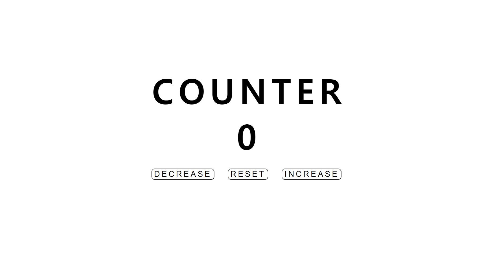
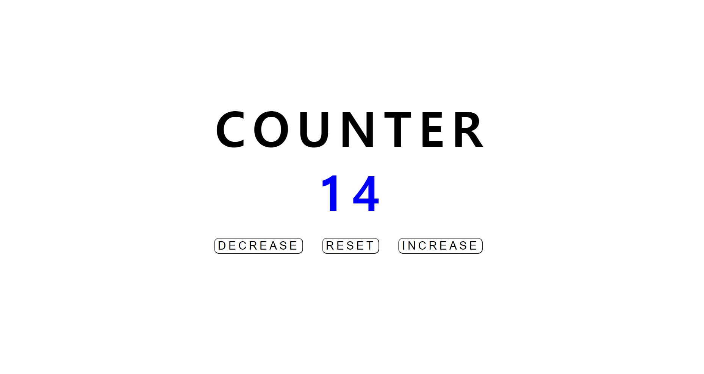
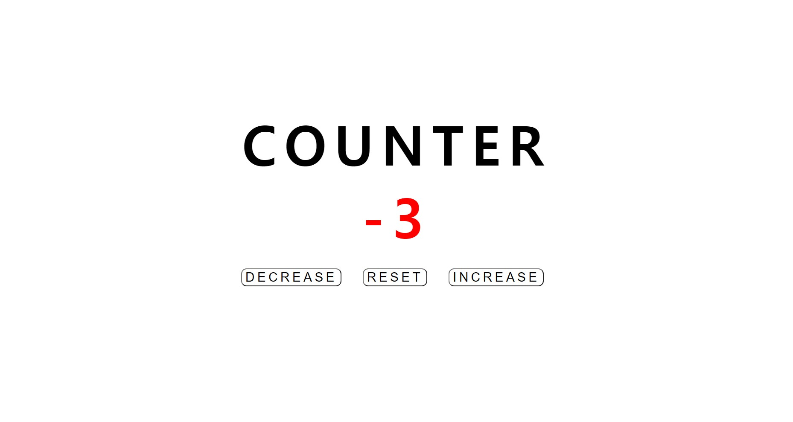

# Simple-Counter
 
<ol>
  <li><strong>프로젝트 이름</strong> : Simple Counter</li>
  <li><strong>사용 언어</strong> : HTML, CSS, Vanila Javascript</li>
  <li><strong>주요 기능</strong> 
    <ul>
      <li><h5>Decrease</h5> 숫자가 1 감소합니다. 0보다 작으면 숫자가 빨간색으로 변합니다.</li>
      <li><h5>Reset</h5>숫자가 0으로 초기화됩니다.</li>
      <li><h5>Increase</h5> 숫자가 1 증가합니다. 0보다 크면 숫자가 파란색으로 변합니다.</li> 
    </ul>
   </li> 

   
  
  <h5> 초기화면 </h5>
  
  <h5> Iecrease </h5>
  
  <h5> Decrease </h5>
  
  

  

  
